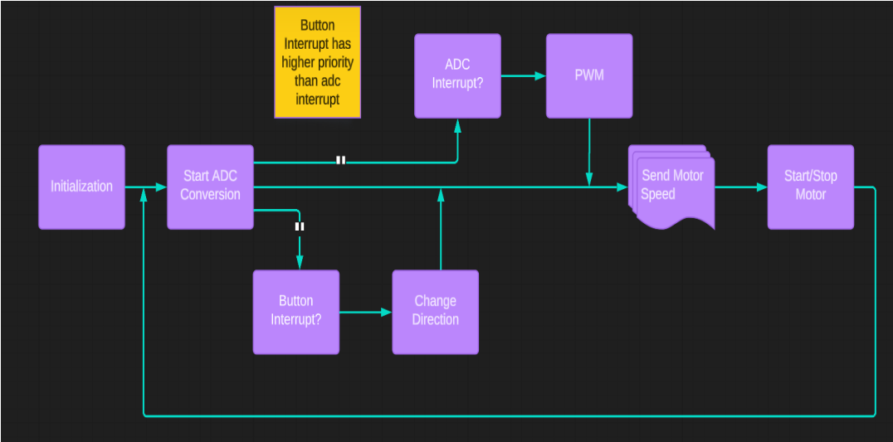
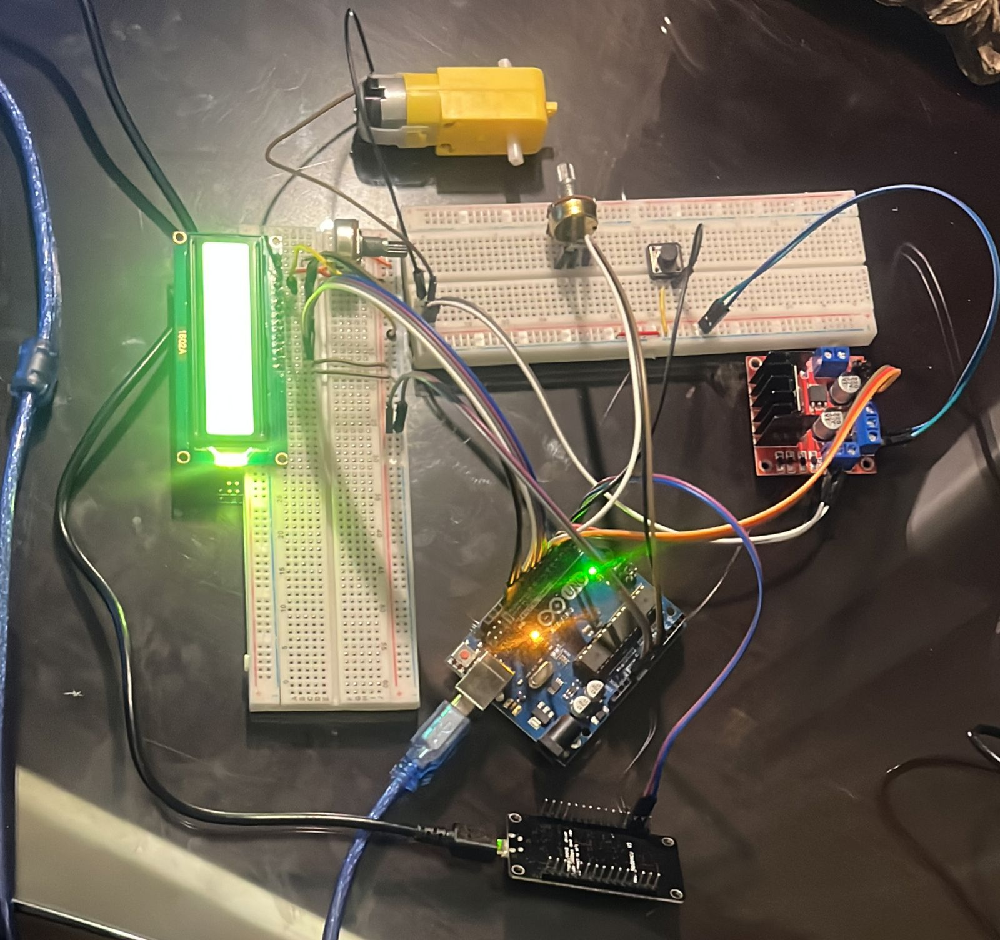
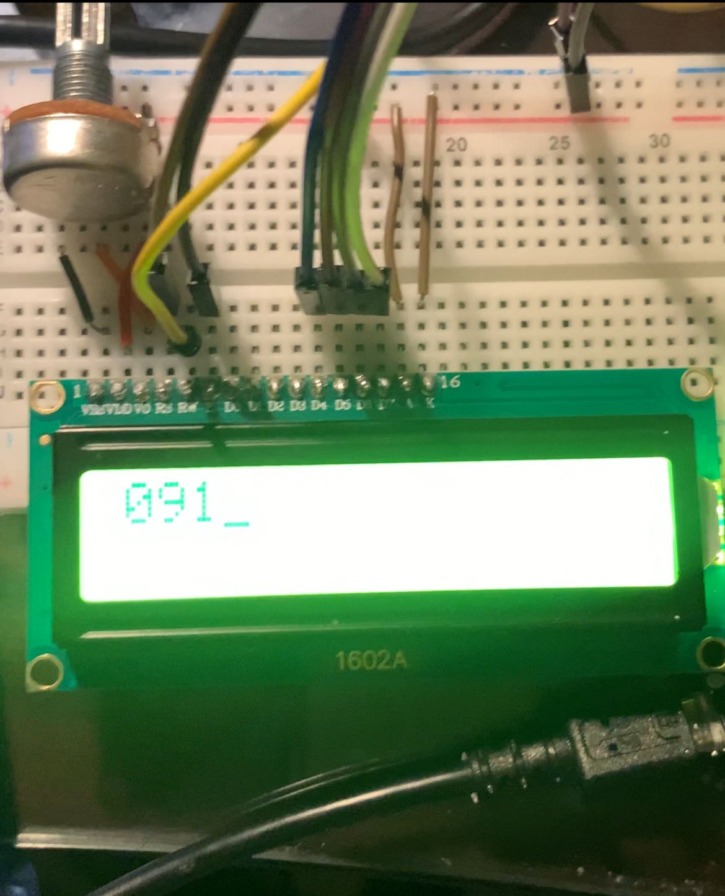
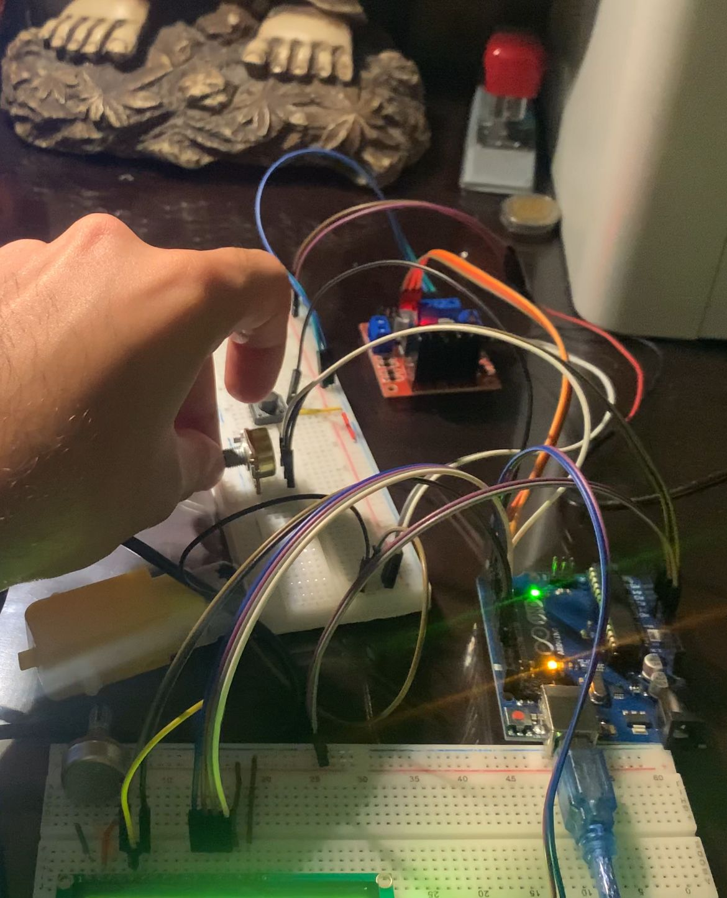

# IoT-MotorControl-MobileApp

## Project Overview

This project enables motor power and speed control via a mobile app using the Blynk platform. The system uses an ATmega32P microcontroller and an ESP8266 module for Wi-Fi communication. Real-time motor status is displayed on an LCD, and the motor's operation is controlled through the Blynk app.

## Features

- **Remote Control:** Adjust motor speed and direction using the Blynk app.
- **LCD Display:** Monitor motor speed and direction in real time.
- **Start/Stop Functionality:** Control motor operation via the app.

## Hardware Components

- ATmega32P Microcontroller
- ESP8266 Wi-Fi Module
- LCD Display
- Motor Driver
- Power Supply
- Mobile Device with Blynk App

## Software Components

- Atmel Studio (for ATmega32P code)
- Arduino IDE (for ESP8266 code)
- Blynk Mobile App

## Code Overview

### ATmega32P Code

The main code for the microcontroller is written in C using Atmel Studio. The code handles motor speed and direction control, communication with the Blynk app via UART, and real-time data display on an LCD.

### ESP8266 Code

The ESP8266 code facilitates communication between the ATmega32P and the Blynk app over Wi-Fi.

## Circuit Diagram

  

## Project Video

Watch the project in action: 

## How to Use

1. Upload the provided code to the ATmega32P microcontroller.
2. Set up the ESP8266 module with the provided code.
   - **Note:** The Wi-Fi settings in the code are unconfigured. Before uploading the code, replace the placeholder values with your specific Wi-Fi credentials (SSID and password).
3. Connect all hardware components as per the circuit diagram.
4. Open the Blynk app and connect to the ESP8266 module.
5. Use the app to control motor speed and direction.

## Project in Action Images

### Mobile App displaying the current running speed of the motor

### LCD displaying the current running speed of the motor which is the same on the mobile application.

### Changing the motors'speed using Potentiometer

---
